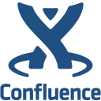

<h2 align="left">Hi there, my name is Tiago</h2>

- 🎓 I completed a Master's in Mathematical Modelling and Computation from the Technical University of Denmark
- 💻 I’m currently working at Deloitte 
- ✔️ My goal for this year is to advance my Data Science and Data Engineering skills
- 💖 I love mathematics, programming, data science and learning new things 

### Languages and Tools 

 

  <code></code>&nbsp;
  <code></code>&nbsp;
  <code></code>&nbsp;
  <code></code>&nbsp;
  <code></code>&nbsp;
  <code></code>&nbsp;
  <code></code>&nbsp;
  <code></code>&nbsp;
  <code></code>&nbsp;
  <code></code>&nbsp;
  <code></code>&nbsp;
  <code></code>&nbsp;

 

<!---->
